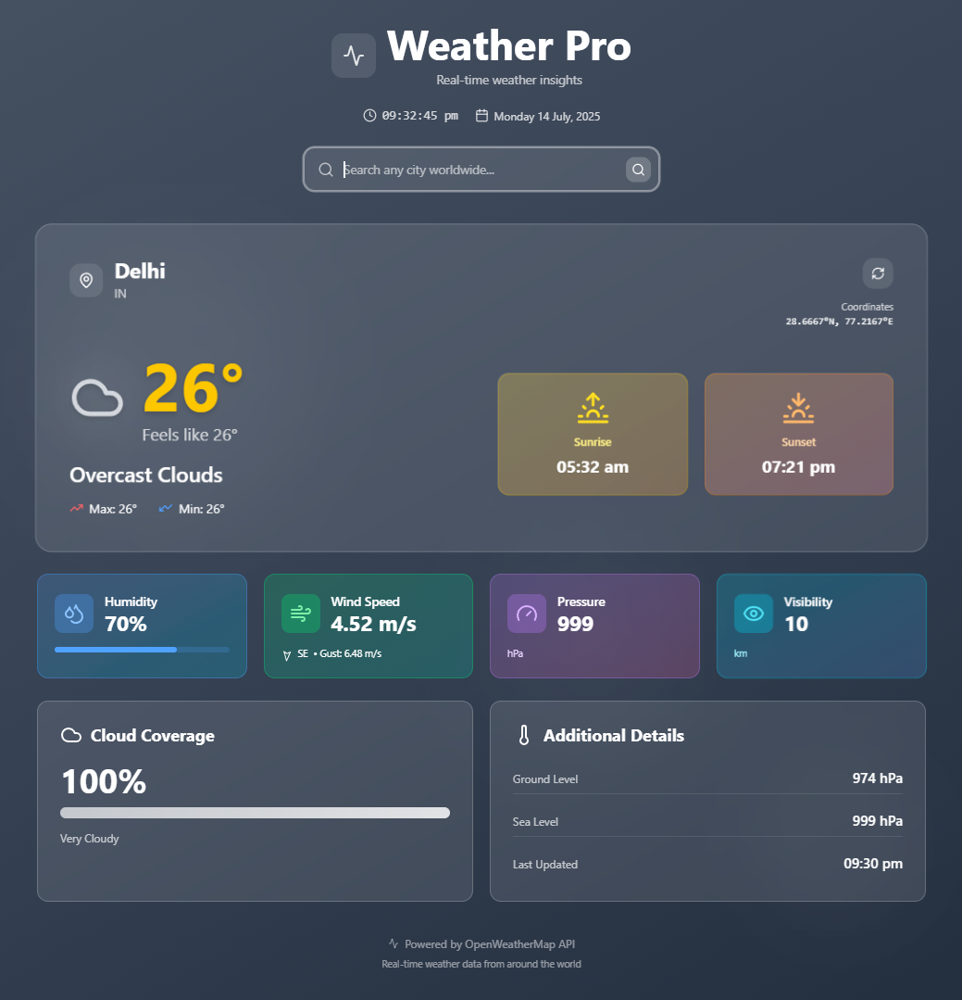
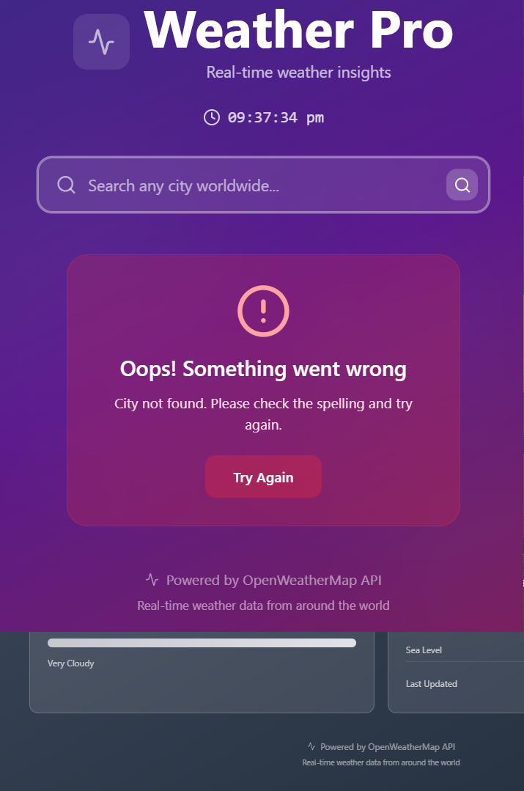

# 🌦️ Weather Pro

**Weather Pro** is a visually stunning and fully responsive real-time weather application built with **React** and **Tailwind CSS**, powered by the **OpenWeatherMap API**. It provides current weather data including temperature, humidity, wind speed, pressure, visibility, cloud coverage, and sunrise/sunset timings.

🔗 **Live App**: [View on GitHub Pages](https://amandeeptyagi.github.io/weather-app/)

## 🚀 Features

- 🔍 City-based weather search  
- 🌐 Global coverage using OpenWeatherMap API  
- 📡 Live time and date display  
- 🌤️ Dynamic background and icon based on weather conditions  
- 🌅 Sunrise and sunset timecards  
- 🌬️ Wind speed with direction indicator  
- 🌫️ Cloud and visibility progress bars  
- 💡 Smooth animations and transitions  
- ⚙️ Real-time data refresh button  
- 📱 Fully responsive layout  

## 🖼️ Screenshots

```
screenshots/
├── home.png
├── cityNotFound.png
```

Example:

  


## 🛠️ Tech Stack

- **React (Vite)**
- **Tailwind CSS**
- **Lucide Icons**
- **OpenWeatherMap API**

## 🔧 Setup Instructions

### 1. Clone the repository

```bash
git clone https://github.com/amandeeptyagi/weather-app.git
cd weather-app
```

### 2. Install dependencies

```bash
npm install
```

### 3. Setup `.env` file

Create a `.env` file in the root directory and add your OpenWeatherMap API key:

```env
VITE_WEATHER_API_KEY=your_openweathermap_api_key_here
```

> Get your API key from: https://openweathermap.org/api

### 4. Run the app

```bash
npm run dev
```

Visit: [http://localhost:5173](http://localhost:5173)

## 🔄 Refresh Weather Data

Click the **↻ (Refresh)** icon on the weather card to update current city weather.

## ❗ Error Handling

If a city is not found, an elegant error message will appear with retry option.

## 📂 Folder Structure

```
weather-pro/
├── public/
├── src/
│   ├── App.jsx
│   └── assets/
├── .env
├── index.html
├── package.json
└── README.md
```

## ✨ Future Enhancements

- 5-day weather forecast
- Auto-detect weather using geolocation
- Dark mode toggle
- Favorite cities list

## 🙏 Credits

- [OpenWeatherMap](https://openweathermap.org/)
- [Lucide Icons](https://lucide.dev/)
- [Tailwind CSS](https://tailwindcss.com/)

## 📄 License

This project is licensed under the [MIT License](LICENSE).

---

> Made with ❤️ by Amandeep Tyagi


🙏If you like this repo please give a star⭐😊.